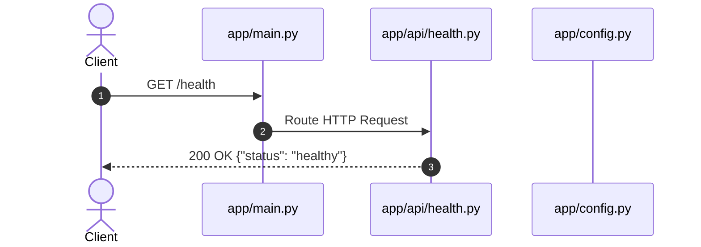

# SkinSense AI - Complete Codebase Documentation

This document provides exhaustive, architectural, and operational documentation for the **SkinSense AI** backend system foundation.

---

## 1. Complete Folder Tree

```text
skin-ai-backend/
├── backend/
│   ├── app/
│   │   ├── ai/
│   │   │   ├── __init__.py
│   │   │   └── README.md
│   │   ├── api/
│   │   │   ├── __init__.py
│   │   │   ├── health.py
│   │   │   └── README.md
│   │   ├── auth/
│   │   │   ├── __init__.py
│   │   │   └── README.md
│   │   ├── core/
│   │   │   ├── __init__.py
│   │   │   └── README.md
│   │   ├── database/
│   │   │   ├── __init__.py
│   │   │   └── README.md
│   │   ├── middleware/
│   │   │   ├── __init__.py
│   │   │   └── README.md
│   │   ├── models/
│   │   │   ├── __init__.py
│   │   │   └── README.md
│   │   ├── repositories/
│   │   │   ├── __init__.py
│   │   │   └── README.md
│   │   ├── schemas/
│   │   │   ├── __init__.py
│   │   │   └── README.md
│   │   ├── services/
│   │   │   ├── __init__.py
│   │   │   └── README.md
│   │   ├── utils/
│   │   │   ├── __init__.py
│   │   │   └── README.md
│   │   ├── workers/
│   │   │   ├── __init__.py
│   │   │   └── README.md
│   │   ├── __init__.py
│   │   ├── config.py
│   │   └── main.py
│   ├── reports/
│   │   ├── .gitkeep
│   │   └── README.md
│   ├── tests/
│   │   ├── __init__.py
│   │   ├── README.md
│   │   └── test_health.py
│   ├── trained_models/
│   │   ├── .gitkeep
│   │   └── README.md
│   ├── uploads/
│   │   ├── .gitkeep
│   │   └── README.md
│   ├── .env.example
│   ├── .gitignore
│   ├── docker-compose.yml
│   ├── Dockerfile
│   ├── README.md
│   └── requirements.txt
└── CODEBASE_DOCUMENTATION.md
```

---

## 2. Directory & File Inventory

### Directories
- `backend/app/`: Primary application package containing domain modules, API routes, and configuration.
- `backend/app/ai/`: Package dedicated to Computer Vision (CV) image processing pipelines and deep learning model inference.
- `backend/app/api/`: API route controllers and endpoints.
- `backend/app/auth/`: Reserved package for user authentication, password hashing, and token validation logic.
- `backend/app/core/`: Application-wide settings, global security rules, logging setups, and error handling.
- `backend/app/database/`: Async engine setup, connection pooling, and migration utilities.
- `backend/app/middleware/`: Custom FastAPI/ASGI middleware for CORS, rate-limiting, and request telemetry.
- `backend/app/models/`: Database ORM models (SQLAlchemy/SQLModel).
- `backend/app/repositories/`: Data Access Object (DAO) pattern implementation for abstracting database queries.
- `backend/app/schemas/`: Pydantic data validation schemas for request bodies and response contracts.
- `backend/app/services/`: Core business logic services, report generation, and external integration handlers.
- `backend/app/utils/`: Generic helper functions, file system utilities, and string transformers.
- `backend/app/workers/`: Background task queue job handlers (Celery / Redis workers).
- `backend/reports/`: Storage folder for generated PDF diagnostic reports.
- `backend/tests/`: Automated unit and integration test suite using `pytest` and `httpx`.
- `backend/trained_models/`: Storage folder for PyTorch/ONNX trained model weights and metadata.
- `backend/uploads/`: Storage directory for raw image uploads submitted for skin lesion analysis.

### Files & Purpose
| File | Path | Purpose |
| :--- | :--- | :--- |
| `main.py` | `backend/app/main.py` | Application entry point; initializes FastAPI app, sets metadata, mounts routers. |
| `config.py` | `backend/app/config.py` | Configuration management class loading settings from `.env` using `pydantic-settings`. |
| `health.py` | `backend/app/api/health.py` | Route controller providing the `/health` status endpoint. |
| `test_health.py` | `backend/tests/test_health.py` | Unit tests covering root (`/`) and health check (`/health`) endpoints. |
| `Dockerfile` | `backend/Dockerfile` | Production container build instructions based on `python:3.11-slim`. |
| `docker-compose.yml` | `backend/docker-compose.yml` | Multi-container setup specification template (commented for development/prod). |
| `.env.example` | `backend/.env.example` | Template containing environment variable keys and sample default values. |
| `.gitignore` | `backend/.gitignore` | Specifies files ignored by Git (caches, environment files, local upload artifacts). |
| `requirements.txt` | `backend/requirements.txt` | Core Python dependencies specification file. |
| `README.md` | `backend/README.md` | Developer guide for building, running, and configuring the backend. |

---

## 3. Architecture & Design Patterns

### Backend Architecture
The backend follows **Clean Architecture** (Layered Domain-Driven Design) principles:
1. **API Layer (`app/api/`)**: Handles HTTP requests, parameter parsing, and serialization.
2. **Domain/Service Layer (`app/services/`)**: Orchestrates business rules, image classification tasks, and PDF compilation.
3. **Data Access Layer (`app/repositories/`)**: Abstracted interface between services and database storage.
4. **Data Models (`app/models/` & `app/schemas/`)**: Decouples persistent database entities from public API JSON models.
5. **AI Layer (`app/ai/`)**: Encapsulates tensor preparation, pre-processing, model inference, and post-processing.

### Entry Point
- **`app.main:app`**: Created in `backend/app/main.py`.

```python
app = FastAPI(
    title=settings.APP_NAME,
    version=settings.APP_VERSION,
    description=settings.APP_DESCRIPTION,
)
```

---

## 4. Machine Learning & Training Pipeline (Status & Blueprint)

### Current Status
- Package initialized under `app/ai/`.
- Weights storage directory prepared at `backend/trained_models/`.

### Planned AI Architecture
1. **Preprocessing Subsystem (`app/ai/preprocess.py`)**:
   - Image resizing (e.g., 224x224 or 384x384 for EfficientNet / Vision Transformers).
   - Hair removal / DullRazor algorithm preprocessing.
   - Color normalization (shading attenuation & white balance).
   - PyTorch Tensor transformation (`torchvision.transforms`).
2. **Inference Engine (`app/ai/inference.py`)**:
   - Model loader utilizing ONNX Runtime or PyTorch C++ bindings for low-latency inference.
   - Multi-class diagnostic classification (e.g., Melanoma, Basal Cell Carcinoma, Squamous Cell Carcinoma, Benign Keratosis, Melanocytic Nevus).
   - Grad-CAM heatmap visualization generation for explainable AI diagnostic reports.

---

## 5. Endpoints & API Specification

### Active Endpoints

#### 1. Root Status Endpoint
- **Method**: `GET`
- **Path**: `/`
- **Description**: Verifies application availability.
- **Response**:
  ```json
  {
    "message": "SkinSense AI Backend Running"
  }
  ```

#### 2. System Health Check
- **Method**: `GET`
- **Path**: `/health`
- **Description**: Monitors system health status.
- **Response**:
  ```json
  {
    "status": "healthy"
  }
  ```

---

## 6. Data & Request Lifecycle



---

## 7. Configuration & Environment Variables

The application relies on `pydantic-settings` via `app.config.Settings`:

| Variable | Type | Default Value | Description |
| :--- | :--- | :--- | :--- |
| `APP_NAME` | `str` | `"SkinSense AI Backend"` | Name of the application instance |
| `APP_VERSION` | `str` | `"0.1.0"` | Release version tag |
| `APP_DESCRIPTION`| `str` | `"Production-grade FastAPI backend..."` | OpenAPI documentation description |
| `ENV` | `str` | `"development"` | Execution environment (`development`/`production`) |
| `DEBUG` | `bool` | `True` | Debug mode toggle |
| `HOST` | `str` | `"0.0.0.0"` | Server network interface binding |
| `PORT` | `int` | `8000` | Server listening port |
| `UPLOADS_DIR` | `str` | `"uploads"` | Folder path for lesion images |
| `REPORTS_DIR` | `str` | `"reports"` | Folder path for generated PDF reports |
| `TRAINED_MODELS_DIR`| `str`| `"trained_models"` | Model weights directory |

---

## 8. Dependencies & Deployment

### Dependencies (`requirements.txt`)
- `fastapi`: Modern async Web framework.
- `uvicorn[standard]`: High-performance ASGI server.
- `pydantic`: Data validation using Python type hints.
- `pydantic-settings`: Hierarchical settings management.
- `pytest`: Automated testing framework.
- `httpx`: Async HTTP client for endpoint testing.

### Deployment Process

#### Local Development
```bash
cd backend
python -m venv venv
# Activate virtual environment
# On Windows: venv\Scripts\activate
# On Linux/macOS: source venv/bin/activate
pip install -r requirements.txt
uvicorn app.main:app --reload --port 8000
```

#### Containerized Build (Docker)
```bash
cd backend
docker build -t skinsense-backend:latest .
docker run -d -p 8000:8000 --name skinsense-api skinsense-backend:latest
```

---

## 9. Security, Performance & Technical Debt

### Security Considerations
- **CORS Policies**: Middleware placeholder established in `app/middleware/`.
- **Environment Secrets**: Sensitive keys managed strictly via `.env` files (excluded from Git).
- **Input Validation**: Pydantic schemas enforce type safety across endpoints.

### Performance Considerations
- **Async Endpoints**: FastAPI native async handlers enable concurrent HTTP processing.
- **Background Processing**: Heavy tasks (PDF report rendering, neural network inference) isolated in `app/workers/`.

### Current Technical Debt & Missing Implementations
1. **Authentication System**: User login, JWT generation, password hashing (`app/auth/`).
2. **Database Layer**: ORM models, migrations, and database session setup (`app/database/`, `app/models/`).
3. **AI Inference Pipeline**: Image preprocessing and PyTorch/ONNX inference execution (`app/ai/`).
4. **File Storage Service**: Local and cloud S3 image upload handlers (`app/services/`).

---

## HOW TO CONTINUE DEVELOPMENT

Follow this recommended step-by-step roadmap to complete the SkinSense AI production backend:

### Phase 1: Database & Persistence Layer
1. Install `sqlalchemy`, `asyncpg`, and `alembic`.
2. Define connection engine and session factory in `app/database/session.py`.
3. Create SQLAlchemy models in `app/models/`:
   - `User`: Patient / Doctor profiles.
   - `Scan`: Image uploads, processing metadata, and diagnostic results.
   - `Report`: PDF metadata and download tokens.
4. Setup Alembic migrations.

### Phase 2: Schemas & Data Validation
1. Create Pydantic schemas in `app/schemas/`:
   - `UserCreate`, `UserResponse`
   - `ScanCreate`, `ScanResponse`
   - `DiagnosisResult`

### Phase 3: File Upload & Storage Service
1. Implement file handler service in `app/services/storage_service.py` to validate image mime types, format dimensions, and save files to `uploads/`.

### Phase 4: AI Model Integration
1. Place trained PyTorch (`.pt`) or ONNX (`.onnx`) model files into `backend/trained_models/`.
2. Implement preprocessing utilities (hair removal, normalization) in `app/ai/preprocess.py`.
3. Implement model inference service in `app/ai/inference.py`.

### Phase 5: Authentication & Authorization
1. Implement JWT utility functions in `app/core/security.py`.
2. Create OAuth2 / JWT authentication handlers in `app/auth/`.

### Phase 6: Diagnostic & Analysis API Endpoints
1. Create scan diagnostic endpoint `POST /api/v1/scans/analyze`.
2. Create report generation endpoint `GET /api/v1/reports/{scan_id}`.
