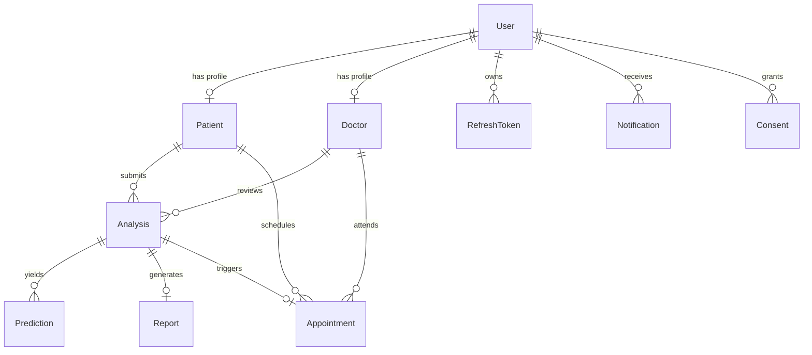

# SkinSense AI - Database Architecture & Entity Design

## Executive Summary
This document defines the production-grade PostgreSQL relational database design for **SkinSense AI**, an AI-powered Skin Cancer Detection System. The architecture strictly adheres to HIPAA/GDPR compliance guidelines, 3rd Normal Form (3NF) relational normalization, spatial-temporal auditability, and query-optimized indexing strategies.

---

## 1. Complete Entity-Relationship (ER) Diagram

---

## 2. Relational Schema & Table Specifications

---

### 2.1 Table: `User`
- **Why it Exists**: Serves as the central authentication identity provider table across all platform personas (Patients, Doctors, Administrators), isolating credentials and access roles from clinical metadata.
- **APIs Consuming This Table**:
  - `POST /api/v1/auth/register`
  - `POST /api/v1/auth/login`
  - `POST /api/v1/auth/logout`
  - `GET /api/v1/auth/me`
  - `PATCH /api/v1/users/me`

#### Columns & Constraints
| Column Name | Data Type | PK | FK | Constraints | Description |
| :--- | :--- | :---: | :---: | :--- | :--- |
| `id` | `UUID` | YES | NO | `DEFAULT gen_random_uuid()` | Unique user account identifier |
| `email` | `VARCHAR(255)` | NO | NO | `NOT NULL, UNIQUE` | User login email address |
| `password_hash` | `VARCHAR(255)` | NO | NO | `NOT NULL` | Argon2id/Bcrypt hashed password |
| `role` | `VARCHAR(32)` | NO | NO | `NOT NULL, CHECK (role IN ('PATIENT', 'DOCTOR', 'ADMIN'))` | Role-based access control (RBAC) |
| `is_active` | `BOOLEAN` | NO | NO | `NOT NULL, DEFAULT true` | Account active toggle |
| `is_verified` | `BOOLEAN` | NO | NO | `NOT NULL, DEFAULT false` | Email verification flag |
| `last_login_at` | `TIMESTAMPTZ` | NO | NO | `NULL` | Timestamp of last authentication |
| `created_at` | `TIMESTAMPTZ` | NO | NO | `NOT NULL, DEFAULT CURRENT_TIMESTAMP` | Entity creation timestamp |
| `updated_at` | `TIMESTAMPTZ` | NO | NO | `NOT NULL, DEFAULT CURRENT_TIMESTAMP` | Entity last modification timestamp |

#### Relationships
- **1-to-1** with `Patient` (Optional)
- **1-to-1** with `Doctor` (Optional)
- **1-to-Many** with `RefreshToken`
- **1-to-Many** with `Notification`
- **1-to-Many** with `Consent`

#### Indexes
- `idx_users_email` ON `User(email)` (B-Tree, UNIQUE)
- `idx_users_role` ON `User(role)` (B-Tree)

---

### 2.2 Table: `Patient`
- **Why it Exists**: Stores patient-specific demographic and clinical metadata required for accurate dermatological contextual analysis (e.g., Fitzpatrick skin type).
- **APIs Consuming This Table**:
  - `GET /api/v1/patients/me`
  - `PUT /api/v1/patients/me`
  - `GET /api/v1/doctors/patients/{patient_id}`

#### Columns & Constraints
| Column Name | Data Type | PK | FK | Constraints | Description |
| :--- | :--- | :---: | :---: | :--- | :--- |
| `id` | `UUID` | YES | NO | `DEFAULT gen_random_uuid()` | Patient record identifier |
| `user_id` | `UUID` | NO | YES | `NOT NULL, UNIQUE, REFERENCES User(id) ON DELETE CASCADE` | Associated authentication user account |
| `first_name` | `VARCHAR(100)` | NO | NO | `NOT NULL` | Patient legal first name |
| `last_name` | `VARCHAR(100)` | NO | NO | `NOT NULL` | Patient legal last name |
| `date_of_birth` | `DATE` | NO | NO | `NOT NULL` | Date of birth for age-based risk calculation |
| `gender` | `VARCHAR(20)` | NO | NO | `NOT NULL, CHECK (gender IN ('MALE', 'FEMALE', 'OTHER', 'PREFER_NOT_TO_SAY'))` | Gender identity |
| `skin_type` | `VARCHAR(10)` | NO | NO | `NULL, CHECK (skin_type IN ('TYPE_I', 'TYPE_II', 'TYPE_III', 'TYPE_IV', 'TYPE_V', 'TYPE_VI'))` | Fitzpatrick scale classification |
| `medical_history`| `JSONB` | NO | NO | `NOT NULL, DEFAULT '{}'::jsonb` | Structured medical history & family history |
| `created_at` | `TIMESTAMPTZ` | NO | NO | `NOT NULL, DEFAULT CURRENT_TIMESTAMP` | Record creation timestamp |
| `updated_at` | `TIMESTAMPTZ` | NO | NO | `NOT NULL, DEFAULT CURRENT_TIMESTAMP` | Record update timestamp |

#### Relationships
- **Belongs to** `User` (via `user_id`)
- **1-to-Many** with `Analysis`
- **1-to-Many** with `Appointment`

#### Indexes
- `idx_patients_user_id` ON `Patient(user_id)` (B-Tree, UNIQUE)

---

### 2.3 Table: `Doctor`
- **Why it Exists**: Maintains practitioner credentialing data, state medical license verification flags, and clinical affiliation details for doctor reviews.
- **APIs Consuming This Table**:
  - `GET /api/v1/doctors/profile`
  - `POST /api/v1/admin/doctors/{doctor_id}/verify`
  - `GET /api/v1/doctors` (Directory listing)

#### Columns & Constraints
| Column Name | Data Type | PK | FK | Constraints | Description |
| :--- | :--- | :---: | :---: | :--- | :--- |
| `id` | `UUID` | YES | NO | `DEFAULT gen_random_uuid()` | Practitioner record identifier |
| `user_id` | `UUID` | NO | YES | `NOT NULL, UNIQUE, REFERENCES User(id) ON DELETE CASCADE` | Associated authentication user account |
| `first_name` | `VARCHAR(100)` | NO | NO | `NOT NULL` | Doctor first name |
| `last_name` | `VARCHAR(100)` | NO | NO | `NOT NULL` | Doctor last name |
| `license_number` | `VARCHAR(100)` | NO | NO | `NOT NULL, UNIQUE` | State/National medical license registration |
| `specialization` | `VARCHAR(150)` | NO | NO | `NOT NULL, DEFAULT 'Dermatology'` | Medical specialty |
| `hospital_affinity`| `VARCHAR(255)`| NO | NO | `NULL` | Clinic / Hospital affiliation |
| `is_approved` | `BOOLEAN` | NO | NO | `NOT NULL, DEFAULT false` | Admin verification & credential check flag |
| `created_at` | `TIMESTAMPTZ` | NO | NO | `NOT NULL, DEFAULT CURRENT_TIMESTAMP` | Record creation timestamp |
| `updated_at` | `TIMESTAMPTZ` | NO | NO | `NOT NULL, DEFAULT CURRENT_TIMESTAMP` | Record update timestamp |

#### Relationships
- **Belongs to** `User` (via `user_id`)
- **1-to-Many** with `Analysis` (Assigned reviews)
- **1-to-Many** with `Appointment`

#### Indexes
- `idx_doctors_user_id` ON `Doctor(user_id)` (B-Tree, UNIQUE)
- `idx_doctors_license` ON `Doctor(license_number)` (B-Tree, UNIQUE)
- `idx_doctors_approval` ON `Doctor(is_approved)` (B-Tree)

---

### 2.4 Table: `Analysis`
- **Why it Exists**: Represents an individual lesion upload analysis session, tracking image storage locations, processing workflow state, anatomical lesion position, and physician triage assignment.
- **APIs Consuming This Table**:
  - `POST /api/v1/scans/upload`
  - `GET /api/v1/scans/{analysis_id}`
  - `GET /api/v1/scans/patient/{patient_id}`
  - `PATCH /api/v1/scans/{analysis_id}/assign-doctor`

#### Columns & Constraints
| Column Name | Data Type | PK | FK | Constraints | Description |
| :--- | :--- | :---: | :---: | :--- | :--- |
| `id` | `UUID` | YES | NO | `DEFAULT gen_random_uuid()` | Analysis session primary key |
| `patient_id` | `UUID` | NO | YES | `NOT NULL, REFERENCES Patient(id) ON DELETE CASCADE` | Associated patient |
| `assigned_doctor_id`| `UUID`| NO | YES | `NULL, REFERENCES Doctor(id) ON DELETE SET NULL` | Reviewing physician |
| `image_url` | `VARCHAR(512)`| NO | NO | `NOT NULL` | S3 / Local storage URL of uploaded skin lesion |
| `lesion_body_location`| `VARCHAR(100)`| NO | NO | `NOT NULL` | Anatomical site (e.g., Left Arm, Back, Face) |
| `status` | `VARCHAR(32)` | NO | NO | `NOT NULL, CHECK (status IN ('PENDING', 'PROCESSING', 'COMPLETED', 'FAILED', 'REVIEWED'))` | Workflow state machine |
| `created_at` | `TIMESTAMPTZ` | NO | NO | `NOT NULL, DEFAULT CURRENT_TIMESTAMP` | Submission timestamp |
| `updated_at` | `TIMESTAMPTZ` | NO | NO | `NOT NULL, DEFAULT CURRENT_TIMESTAMP` | Status change timestamp |

#### Relationships
- **Belongs to** `Patient` (via `patient_id`)
- **Belongs to** `Doctor` (Optional, via `assigned_doctor_id`)
- **1-to-Many** with `Prediction`
- **1-to-1** with `Report`

#### Indexes
- `idx_analysis_patient_id` ON `Analysis(patient_id)` (B-Tree)
- `idx_analysis_doctor_id` ON `Analysis(assigned_doctor_id)` (B-Tree)
- `idx_analysis_status` ON `Analysis(status)` (B-Tree)

---

### 2.5 Table: `Prediction`
- **Why it Exists**: Stores the output of deep learning model inferences, recording classified lesion types (e.g. Melanoma, Nevus), confidence metrics, class probabilities, and Grad-CAM visual explainability maps.
- **APIs Consuming This Table**:
  - `GET /api/v1/scans/{analysis_id}/predictions`
  - Internal AI Inference Worker Service

#### Columns & Constraints
| Column Name | Data Type | PK | FK | Constraints | Description |
| :--- | :--- | :---: | :---: | :--- | :--- |
| `id` | `UUID` | YES | NO | `DEFAULT gen_random_uuid()` | Prediction record identifier |
| `analysis_id` | `UUID` | NO | YES | `NOT NULL, REFERENCES Analysis(id) ON DELETE CASCADE` | Associated scan analysis session |
| `model_version` | `VARCHAR(50)` | NO | NO | `NOT NULL` | AI neural net model version tag |
| `predicted_class` | `VARCHAR(100)` | NO | NO | `NOT NULL` | Top predicted diagnostic classification |
| `confidence_score`| `NUMERIC(5,4)`| NO | NO | `NOT NULL, CHECK (confidence_score BETWEEN 0 AND 1)` | Primary confidence probability |
| `class_probabilities`| `JSONB` | NO | NO | `NOT NULL` | Complete probability distribution across classes |
| `heatmap_url` | `VARCHAR(512)`| NO | NO | `NULL` | Grad-CAM visual heat map asset path |
| `created_at` | `TIMESTAMPTZ` | NO | NO | `NOT NULL, DEFAULT CURRENT_TIMESTAMP` | Inference execution timestamp |

#### Relationships
- **Belongs to** `Analysis` (via `analysis_id`)

#### Indexes
- `idx_predictions_analysis_id` ON `Prediction(analysis_id)` (B-Tree)

---

### 2.6 Table: `Report`
- **Why it Exists**: Stores PDF diagnostic reports compiled from AI predictions and doctor notes, protecting download access with cryptographic tokens.
- **APIs Consuming This Table**:
  - `POST /api/v1/reports/generate`
  - `GET /api/v1/reports/{report_id}`
  - `GET /api/v1/reports/download/{download_token}`

#### Columns & Constraints
| Column Name | Data Type | PK | FK | Constraints | Description |
| :--- | :--- | :---: | :---: | :--- | :--- |
| `id` | `UUID` | YES | NO | `DEFAULT gen_random_uuid()` | Report entity primary key |
| `analysis_id` | `UUID` | NO | YES | `NOT NULL, UNIQUE, REFERENCES Analysis(id) ON DELETE CASCADE` | Target analysis session |
| `pdf_url` | `VARCHAR(512)`| NO | NO | `NOT NULL` | Rendered PDF document storage location |
| `doctor_notes` | `TEXT` | NO | NO | `NULL` | Reviewing physician notes and clinical recommendations |
| `severity_level` | `VARCHAR(32)` | NO | NO | `NOT NULL, CHECK (severity_level IN ('LOW', 'MEDIUM', 'HIGH', 'CRITICAL'))` | Risk triage level |
| `download_token` | `VARCHAR(128)`| NO | NO | `NOT NULL, UNIQUE` | Secure token for external report downloads |
| `generated_at` | `TIMESTAMPTZ` | NO | NO | `NOT NULL, DEFAULT CURRENT_TIMESTAMP` | Generation completion timestamp |

#### Relationships
- **1-to-1** with `Analysis` (via `analysis_id`)

#### Indexes
- `idx_reports_analysis_id` ON `Report(analysis_id)` (B-Tree, UNIQUE)
- `idx_reports_download_token` ON `Report(download_token)` (B-Tree, UNIQUE)

---

### 2.7 Table: `Appointment`
- **Why it Exists**: Manages clinical follow-up consultations between patients and dermatologists prompted by high-risk lesion predictions.
- **APIs Consuming This Table**:
  - `POST /api/v1/appointments/schedule`
  - `GET /api/v1/appointments/my-appointments`
  - `PATCH /api/v1/appointments/{appointment_id}/status`

#### Columns & Constraints
| Column Name | Data Type | PK | FK | Constraints | Description |
| :--- | :--- | :---: | :---: | :--- | :--- |
| `id` | `UUID` | YES | NO | `DEFAULT gen_random_uuid()` | Appointment primary key |
| `patient_id` | `UUID` | NO | YES | `NOT NULL, REFERENCES Patient(id) ON DELETE CASCADE` | Patient participant |
| `doctor_id` | `UUID` | NO | YES | `NOT NULL, REFERENCES Doctor(id) ON DELETE CASCADE` | Dermatologist participant |
| `analysis_id` | `UUID` | NO | YES | `NULL, REFERENCES Analysis(id) ON DELETE SET NULL` | Triggering scan analysis (optional) |
| `appointment_date`| `TIMESTAMPTZ`| NO | NO | `NOT NULL` | Scheduled consultation date and time |
| `status` | `VARCHAR(32)` | NO | NO | `NOT NULL, CHECK (status IN ('SCHEDULED', 'COMPLETED', 'CANCELLED', 'NO_SHOW'))` | Booking state |
| `notes` | `TEXT` | NO | NO | `NULL` | Pre-visit / Post-visit clinical notes |
| `created_at` | `TIMESTAMPTZ` | NO | NO | `NOT NULL, DEFAULT CURRENT_TIMESTAMP` | Booking creation timestamp |
| `updated_at` | `TIMESTAMPTZ` | NO | NO | `NOT NULL, DEFAULT CURRENT_TIMESTAMP` | Booking modification timestamp |

#### Relationships
- **Belongs to** `Patient` (via `patient_id`)
- **Belongs to** `Doctor` (via `doctor_id`)
- **Belongs to** `Analysis` (Optional, via `analysis_id`)

#### Indexes
- `idx_appointments_patient` ON `Appointment(patient_id)` (B-Tree)
- `idx_appointments_doctor` ON `Appointment(doctor_id)` (B-Tree)
- `idx_appointments_date` ON `Appointment(appointment_date)` (B-Tree)

---

### 2.8 Table: `Notification`
- **Why it Exists**: Stores in-app messages and push alerts sent to patients and doctors regarding scan statuses, physician reviews, and appointment updates.
- **APIs Consuming This Table**:
  - `GET /api/v1/notifications`
  - `PATCH /api/v1/notifications/{notification_id}/read`
  - Internal Notification Worker Service

#### Columns & Constraints
| Column Name | Data Type | PK | FK | Constraints | Description |
| :--- | :--- | :---: | :---: | :--- | :--- |
| `id` | `UUID` | YES | NO | `DEFAULT gen_random_uuid()` | Notification primary key |
| `user_id` | `UUID` | NO | YES | `NOT NULL, REFERENCES User(id) ON DELETE CASCADE` | Recipient user account |
| `title` | `VARCHAR(150)`| NO | NO | `NOT NULL` | Short message heading |
| `message` | `TEXT` | NO | NO | `NOT NULL` | Complete notification body |
| `type` | `VARCHAR(50)` | NO | NO | `NOT NULL, CHECK (type IN ('ANALYSIS_COMPLETE', 'DOCTOR_REVIEW_READY', 'APPOINTMENT_REMINDER', 'SYSTEM_ALERT'))` | Categorical notification type |
| `is_read` | `BOOLEAN` | NO | NO | `NOT NULL, DEFAULT false` | Read confirmation state |
| `created_at` | `TIMESTAMPTZ` | NO | NO | `NOT NULL, DEFAULT CURRENT_TIMESTAMP` | Sent timestamp |

#### Relationships
- **Belongs to** `User` (via `user_id`)

#### Indexes
- `idx_notifications_user_unread` ON `Notification(user_id, is_read)` (B-Tree)

---

### 2.9 Table: `Consent`
- **Why it Exists**: Maintains immutable patient legal consents for HIPAA/GDPR regulatory compliance regarding AI data processing, data privacy policies, and research sharing.
- **APIs Consuming This Table**:
  - `POST /api/v1/legal/consent`
  - `GET /api/v1/legal/my-consents`

#### Columns & Constraints
| Column Name | Data Type | PK | FK | Constraints | Description |
| :--- | :--- | :---: | :---: | :--- | :--- |
| `id` | `UUID` | YES | NO | `DEFAULT gen_random_uuid()` | Consent record primary key |
| `user_id` | `UUID` | NO | YES | `NOT NULL, REFERENCES User(id) ON DELETE CASCADE` | Granting user account |
| `consent_type` | `VARCHAR(64)` | NO | NO | `NOT NULL, CHECK (consent_type IN ('TERMS_OF_SERVICE', 'PRIVACY_POLICY', 'AI_PROCESSING_CONSENT', 'RESEARCH_DATA_SHARING'))` | Legal policy identifier |
| `is_granted` | `BOOLEAN` | NO | NO | `NOT NULL` | Opt-in / Opt-out decision state |
| `ip_address` | `VARCHAR(45)` | NO | NO | `NOT NULL` | IP address at time of agreement |
| `granted_at` | `TIMESTAMPTZ` | NO | NO | `NOT NULL, DEFAULT CURRENT_TIMESTAMP` | Agreement timestamp |
| `revoked_at` | `TIMESTAMPTZ` | NO | NO | `NULL` | Revocation timestamp if opted-out |

#### Relationships
- **Belongs to** `User` (via `user_id`)

#### Indexes
- `idx_consent_user_type` ON `Consent(user_id, consent_type)` (B-Tree)

---

### 2.10 Table: `RefreshToken`
- **Why it Exists**: Persists hashed refresh tokens to enable secure multi-device session management, token rotation, and immediate revocation upon logout or breach detection.
- **APIs Consuming This Table**:
  - `POST /api/v1/auth/refresh`
  - `POST /api/v1/auth/logout`

#### Columns & Constraints
| Column Name | Data Type | PK | FK | Constraints | Description |
| :--- | :--- | :---: | :---: | :--- | :--- |
| `id` | `UUID` | YES | NO | `DEFAULT gen_random_uuid()` | Token record identifier |
| `user_id` | `UUID` | NO | YES | `NOT NULL, REFERENCES User(id) ON DELETE CASCADE` | Associated user account |
| `token_hash` | `VARCHAR(255)`| NO | NO | `NOT NULL, UNIQUE` | Cryptographic hash of refresh token |
| `device_info` | `VARCHAR(255)`| NO | NO | `NULL` | User agent / Client device identifier |
| `ip_address` | `VARCHAR(45)` | NO | NO | `NULL` | Client IP address during issuance |
| `is_revoked` | `BOOLEAN` | NO | NO | `NOT NULL, DEFAULT false` | Revocation status flag |
| `expires_at` | `TIMESTAMPTZ` | NO | NO | `NOT NULL` | Token expiration timestamp |
| `created_at` | `TIMESTAMPTZ` | NO | NO | `NOT NULL, DEFAULT CURRENT_TIMESTAMP` | Issuance timestamp |

#### Relationships
- **Belongs to** `User` (via `user_id`)

#### Indexes
- `idx_refreshtokens_hash` ON `RefreshToken(token_hash)` (B-Tree, UNIQUE)
- `idx_refreshtokens_user` ON `RefreshToken(user_id)` (B-Tree)

---

## 3. Relationship Explanations & Integrity Rules

1. **User - Patient / Doctor (1-to-1)**:
   - A single `User` record maps to either a `Patient` profile or a `Doctor` profile based on `User.role`. Cascading deletes ensure account removal cleanly deletes linked profile records.
2. **Patient - Analysis (1-to-Many)**:
   - A `Patient` can submit multiple lesion `Analysis` sessions over time. Deleting a patient cascades to their analyses.
3. **Analysis - Prediction (1-to-Many)**:
   - An `Analysis` session yields one or more `Prediction` rows (allowing re-analysis with newer model versions).
4. **Analysis - Report (1-to-1)**:
   - Each `Analysis` links to exactly one compiled PDF `Report` document.
5. **Doctor - Analysis (1-to-Many)**:
   - A `Doctor` can be assigned to review multiple `Analysis` sessions. If a doctor account is deleted, foreign keys in `Analysis.assigned_doctor_id` are set to `NULL` to preserve patient scan history.
6. **Patient / Doctor - Appointment (1-to-Many)**:
   - Connects patients and doctors for consultations, with optional links back to the originating scan `Analysis`.
